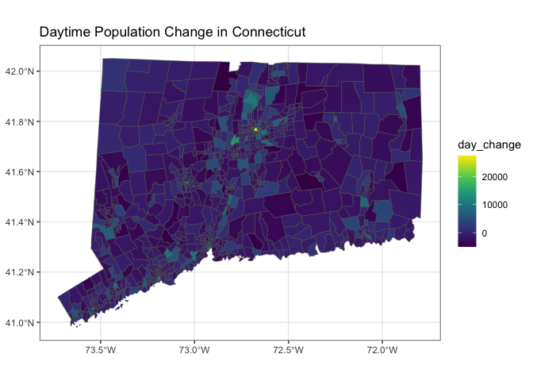

<!-- README.md is generated from README.Rmd. Please edit that file -->

# final.bis620

<!-- badges: start -->

[](https://github.com/aespears/final.bis620/actions/workflows/R-CMD-check.yaml)
[](https://app.codecov.io/gh/aespears/final.bis620?branch=main)
<!-- badges: end -->

The goal of final.bis620 is to look at the Social Vulnerability dataset
and analyze what differentiates regions where the population increases
during the day and regions where the population decreases during the
day.

## Installation

You can install the development version of final.bis620 from
[GitHub](https://github.com/) with:

``` r
# install.packages("devtools")
devtools::install_github("aespears/final.bis620")
#> Skipping install of 'final.bis620' from a github remote, the SHA1 (5c59bda3) has not changed since last install.
#>   Use `force = TRUE` to force installation
```

## Example

This plot shows how

``` r
library(final.bis620)
library(sf)
#> Linking to GEOS 3.11.0, GDAL 3.5.3, PROJ 9.1.0; sf_use_s2() is TRUE
```

``` r
ct <- fips_data |> dplyr::filter(ST_ABBR == 'CT')
ct$day_change <- day_dif(ct$E_DAYPOP, ct$E_TOTPOP)

plot_map(ct, 'geometry', 'day_change', 'Daytime Population Change in Connecticut')
```



In the analysis described in the vignette, we explore factors that
contribute to a change in population like this, including Per Capita
Income and population demographics that might mean people are more
likely to commute.
